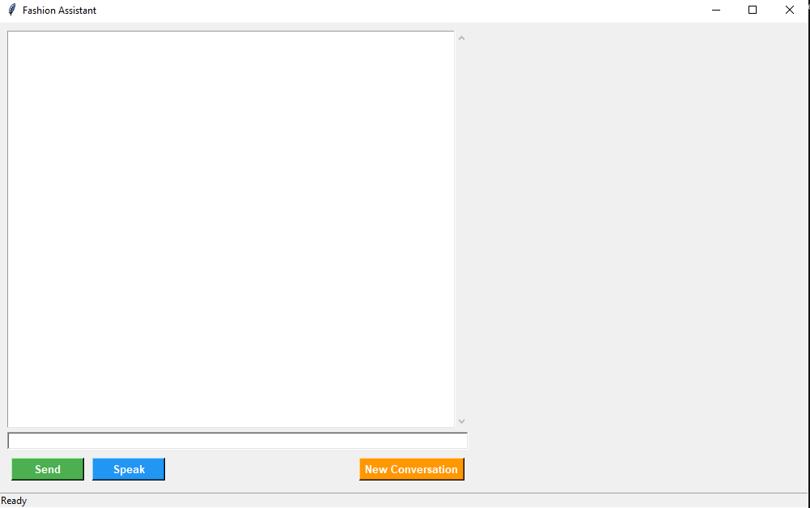

# Fashion Recommender Agent

TU Delft, 2025. Course: Conversational Agents.



## Installing and running

To install the application, you will need to follow these instructions, and make sure you have Ollama downloaded and installed.

> You can install Ollama via the [Ollama download page](https://ollama.com/download).

We use `uv`  as the package manager

> Install `uv` through `pip`  if you have it, otherwise follow instructions on the [official Uv installation docs](https://docs.astral.sh/uv/getting-started/installation/).

```sh
pip install uv 
uv venv
uv run main.py
```

## Environment Variables

Add your (free) key obtained at mistral.ai to the MISTRAL_API_KEY environment variable before starting. The windows command to do that is: `setx MISTRAL_API_KEY <...>`.

## Experiment configuration
To restrict the agent's memory to only the current conversation, give the command line argument
`--disable-long-term-retrieval` (or `-d` as shorter alias). 

## Linux

The `sounddevice` library requires the PortAudio bindings to be available on your device. MacOS and Windows install them automatically, but for Linux you will have to install them yourself. The package is likely called `libportaudio2` (on `apt`). Also see [the sounddevice docs](https://python-sounddevice.readthedocs.io/en/0.5.1/installation.html)